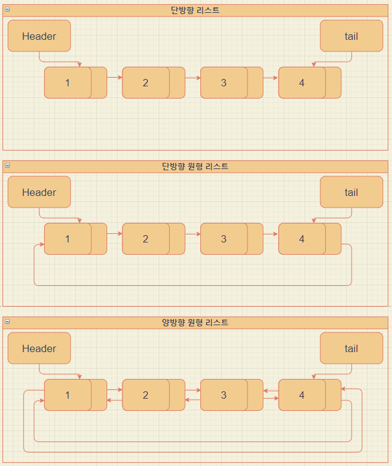

# C언어를 통하여 자료구조 List 만들기

리스트 자료구조는 연결리스트 자료구조를 사용하였고
메모리를 할당해서 자료를 연결시킨다. 방향은 양방향이다.
거의 모든언어 에서 제공되는 List를 구현함으로써 얼마나 다른언어가 강력한지 다시 한번 깨닫게 되었다. C언어로 프로그램을 개발하게 된다면 소요시간이 매우 많이 걸릴것 같다.

기능은 다음과 같다.
-	추가
-	리스트보기 (내림차순,오름차순)


다음은 리스트의 단방향, 단방향 원형, 양방향 원형 리스트의 형태를 보여주는 그림이다.
오늘 만들어볼 자료구조는 양방향 원형 리스트이다. 양방향으로 개발되었기 때문에
데이터 조회시 내림차순, 오름차순을 아주 쉽게 구현 할 수 있었다.

앞서 올린 단방향보다 소스 길이가 짧은데 인덱스 기능을 뺐다. 인덱스 기능도 넣어보길 바란다.

우선 추가 리스트보기만 구현하였다.
삭제부분은 직접 해보길 바란다. 




> List.c

```c
#include<stdio.h>
#include<stdlib.h>
#include "List.h"


Node* CreateNode() {
	Node* temp = (Node*)malloc(sizeof(Node));
	temp->data = 0;
	temp->next = NULL;
	temp->prev = NULL;
	return temp;
}

void initList(List* plist) {
	plist->head = CreateNode();
	plist->tail = CreateNode();
	plist->size = 0;
};
void add(List* plist, int data) {
	if (plist->head->next == NULL) {
		Node* newNode = CreateNode();
		newNode->data = data;

		plist->head->next = newNode;
		plist->tail->next = newNode;
		(plist->size)++;
	}
	else {
		Node* newNode = CreateNode();
		newNode->data = data;

		Node* cur = plist->tail->next;
		cur->next = newNode;
		newNode->prev = cur;
		newNode->next = plist->head->next;
		plist->tail->next = newNode;
		plist->head->next->prev = plist->tail->next;
		(plist->size)++;
	}
};

void show(List* plist , int order) {
	if (order == 0) {
		Node* cur = plist->head->next;
		
		do {
			printf("값: %d \n", cur->data);
			cur = cur->next;
		} while (cur->prev != plist->tail->next);
	}
	else {
		Node* cur = plist->tail->next;
		do {
			printf("값: %d \n", cur->data);
			cur = cur->prev;
		} while (cur->next != plist->head->next);
	}
}
```

>List.h

```c
#ifndef  __LIST_H__
#define __LIST_H__

typedef struct node {
	struct node* next;
	struct node* prev;
	int data;
}Node;

typedef struct iist {
	Node* head;
	Node* tail;
	int size;
}List;

void initList(List* plist);
void add(List* plist, int data);s
void show(List* plist, int order);
#endif // ! __LIST_H__

```

>main.c

```c
#include<stdlib.h>
#include<stdio.h>
#include "List.h"


int main(void) {

	List* list = (List*)malloc(sizeof(List));
	initList(list);

	add(list, 1);
	add(list, 2);
	add(list, 3);
	add(list, 4);
	add(list, 5);


	printf("내림차순 \n");
	show(list, 0);
	
	printf("\n\n");

	printf("오름차순 \n");
	show(list, 1);

	return 0;
}
```

결과값

~~~

내림차순
값: 1
값: 2
값: 3
값: 4
값: 5


오름차순
값: 5
값: 4
값: 3
값: 2
값: 1

~~~