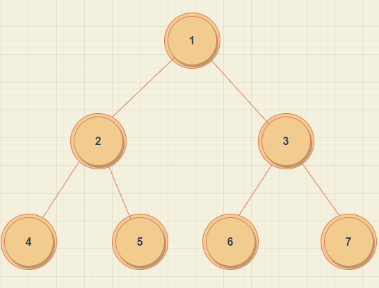

# 트리란?

트리는 비선형 자료구조이다. 

트리는 계층적 관계를 표현하는 자료구조이다.
다음 특성에 맞게 자료구조를 작성해보았다.

트리의 구조형태



다음 트리구조의 형태를 소스로 표현해보겠다.
다음 소스에서 pop 함수는 무시하여도 된다. 추가하는 부분을 코드로 표현한것 뿐이다.(수동으로 추가하기 귀찮아서)

showNode 함수는 전위 순회로 데이터를 조회한다.
따라서 데이터를 조회해보면

~~~
1
2
4
5
3
6
7
~~~

다음과 같이 출력되면 정상이다.

>데이터출력 설명란

루트 1 -> 왼쪽 자식 -> 2 -> 왼쪽 자식 -> 4 -> NULL 중지

루트 1 -> 왼쪽 자식 -> 2 -> 오른쪽 자식 -> 5 -> NULL 중지

루트 1 -> 오른쪽 자식 -> 3 -> 왼쪽 자식 -> 6 -> NULL 중지

루트 1 -> 오른쪽 자식 -> 3 -> 오른쪽 자식 -> 7 -> NULL 중지

>main.c

```cpp
#include <stdio.h>
#include <stdlib.h>

#include "Tree.h"


int main(void) {

	Tree* tr = (Tree*)malloc(sizeof(Tree));
	initTree(tr);

	for (int i = 1; i < 8; i++) {
		add(tr, i);
	}

	showNode(tr->root);

	return 0;
}
```

>Tree.c

```cpp
#include <stdio.h>
#include <stdlib.h>

#include "Tree.h"

void initTree(Tree* tr) {
	tr->numOfTree = 0;
	tr->root = NULL;
}
Node* createNode() {
	Node* newNode = (Node*)malloc(sizeof(Node));
	newNode->data = 0;
	newNode->index = 0;
	newNode->left = NULL;
	newNode->right = NULL;
}
void connectLeftNode(Node* parent, Node* child) {
	parent->left = child;
}
void connectRightNode(Node* parent, Node* child) {
	parent->right = child;
}
int childLeftNode(int number) {
	return number * 2;
}
int childRightNode(int number) {
	return (number * 2 + 1);
}
void showNode(Node* root) {
	if (root == NULL) return;
	printf("%d \n", root->data);
	showNode(root->left);
	showNode(root->right);
}
// 2, 3 
// 4, 5, 6, 7
void curNode(Node* root, Node* newNode, int index, int LastIndex) {
	if (index > LastIndex) return;
	if (root->left== NULL && LastIndex == childLeftNode(index)) {
		root->left = newNode;
		return;
	}
	if (root->right == NULL && LastIndex == childRightNode(index)) {
		root->right = newNode;
		return;
	}
	curNode(root->left, newNode, childLeftNode(index), LastIndex);
	curNode(root->right, newNode, childRightNode(index), LastIndex);

}

void add(Tree* tree, int data){
	
	Node* newNode = createNode();
	newNode->data = data;
	newNode->index = tree->numOfTree;
	if (tree->root == NULL) {
		tree->root = newNode;
	}
	else {
		curNode(tree->root, newNode, 1, tree->numOfTree + 1);
	}
	tree->numOfTree++;
}

```

>Tree.h

```cpp
#ifndef __TREE_H__
#define __TREE_H__

#define TRUE 1
#define FALSE 0

typedef struct __node
{
	int data;
	int index;
	struct __node* left;
	struct __node* right;
}Node;

typedef struct __tree
{
	Node* root;
	int numOfTree;
}Tree;

void initTree(Tree* tr);
Node* createNode();
void connectLeftNode(Node* parent, Node* child);
void connectRightNode(Node* parent, Node* child);
int childLeftNode(int number);
int childRightNode(int number);
void showNode(Node* root);
void curNode(Node* root, Node* newNode, int index, int LastIndex);
void add(Tree* tree, int data);

#endif
```