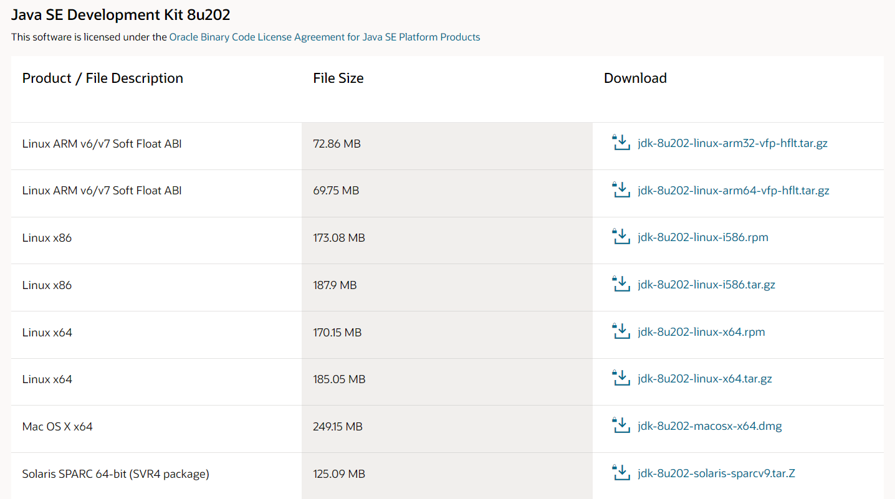

# java 설치하기

오라클 홈페이지

[https://www.oracle.com/kr/java/technologies/javase/javase8-archive-downloads.html](https://www.oracle.com/kr/java/technologies/javase/javase8-archive-downloads.html)

다음 화면에서 Linux 버전용 jdk를 다운로드 받는다.

# 저장할 폴더 생성

~~~
mkdir -pv /u01/java
~~~

# 압축 풀기

~~~
tar -zxvf jdk-8u202-linux-x64.tar.gz
~~~

# 환경변수 설정하기

파일열기

~~~
vi .bash_profile
~~~

값 추가

~~~
export JAVA_HOME=/u01/java/jdk1.8.0_202
export PATH=$PATH:$JAVA_HOME/bin
~~~

파일 갱신

~~~
source .bash_profile
~~~

# java check

~~~
java -version
~~~