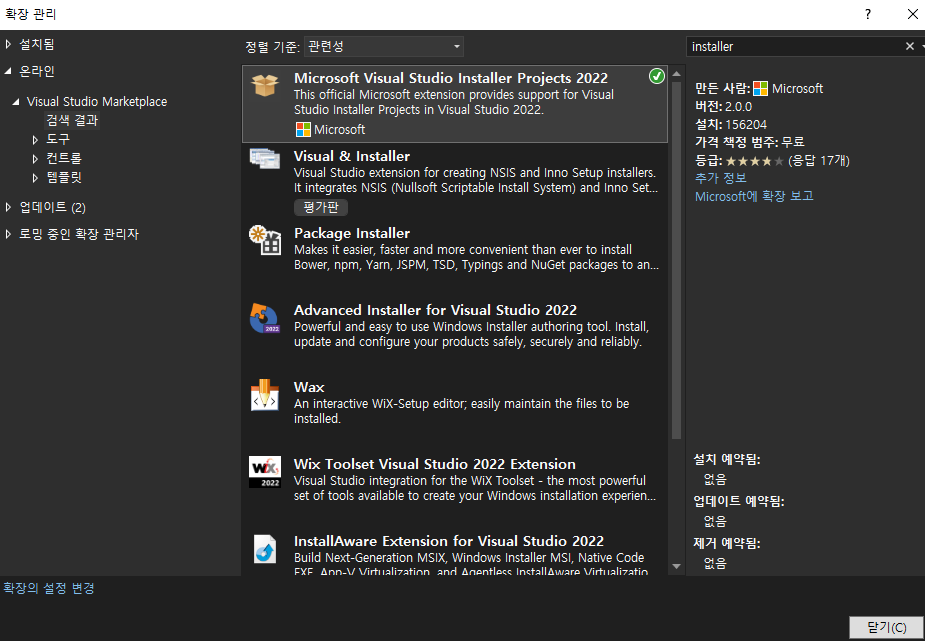
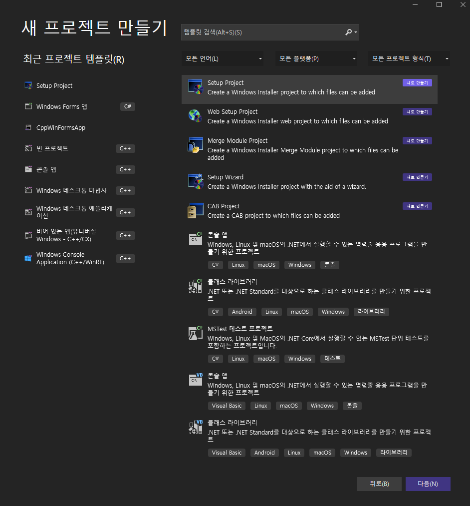
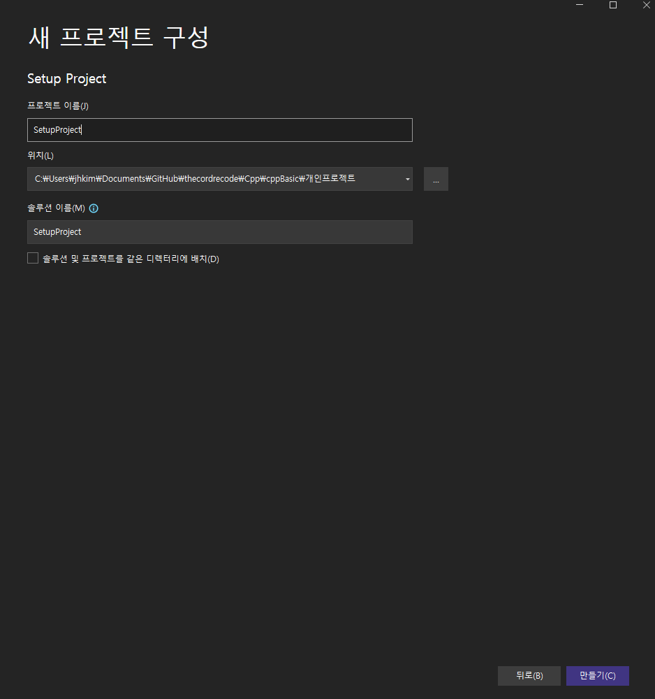
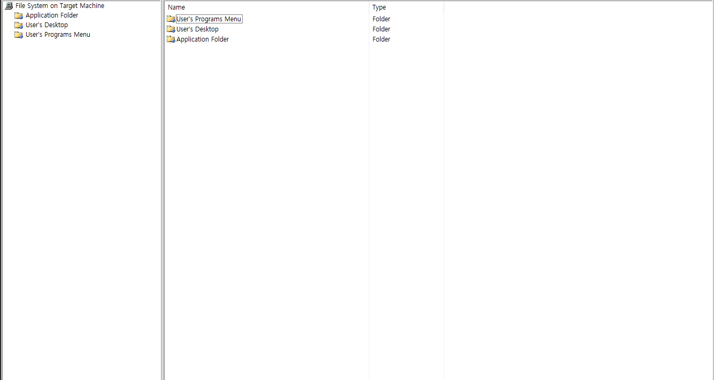
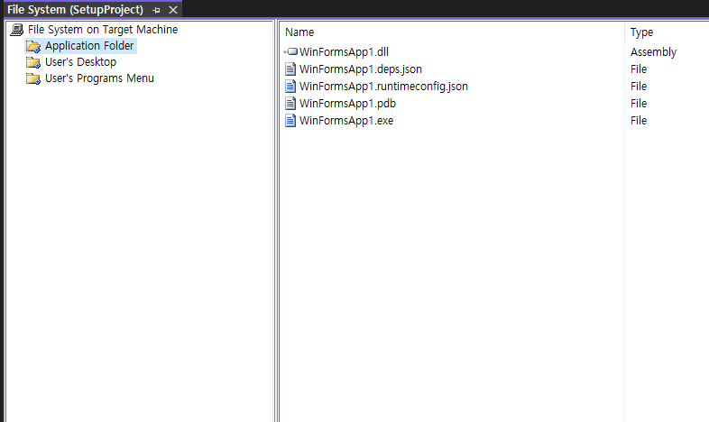
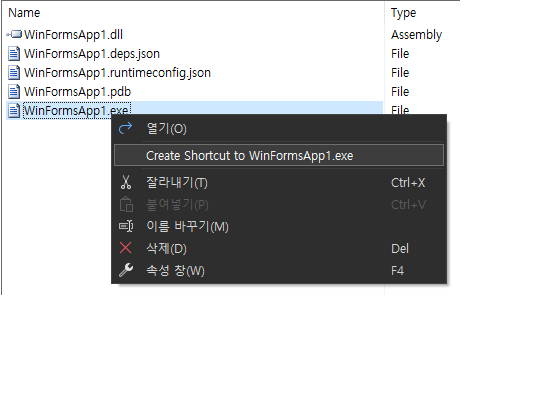
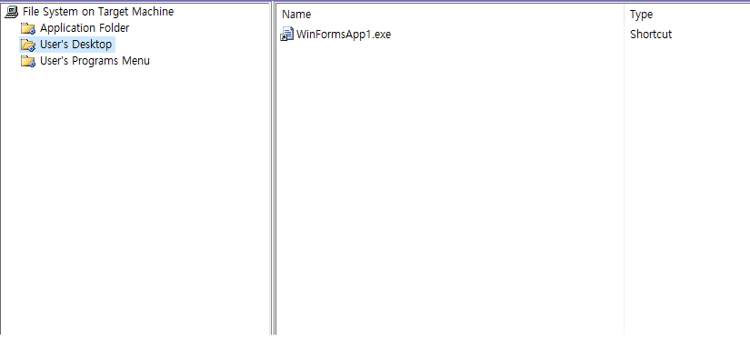
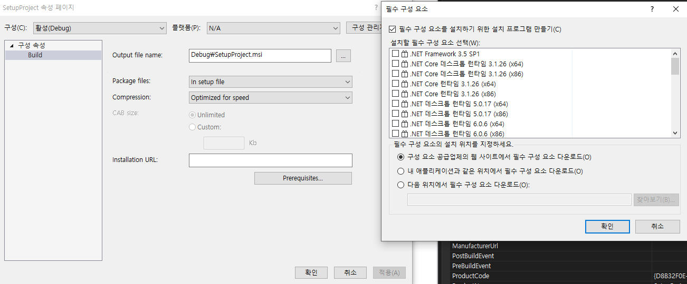
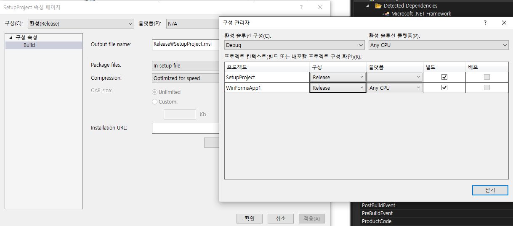
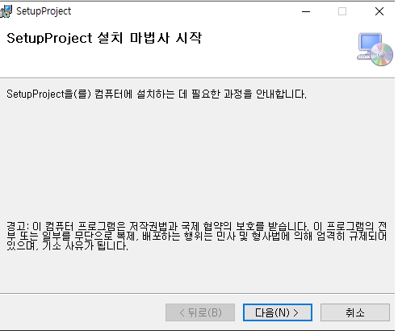

# 설치파일 만들기

확장 프로그램 설치하기 
Microsoft Visual Studio installer Projects 설치

프로젝트 생성하기

Application Folder 
-> 설치할 파일들을 넣는다.

User's Desktop
-> 바탕화면에 바로가기 생성용

User's Programs Menu
-> 사용자 프로그램 메뉴 생성

설치할 프로그램 넣기

바로가기 화면 만들기 실행 파일 Shortcut 를 생성후 User's Desktop,User's Programs Menu 으로 옴겨준다.

설치 구성정보를 셋팅해준다.

설치하기전에 필수 설치해줘야하는것들을 체크해준다.

설치파일을 만들기 위해 디버그 모드에서 릴리즈 모드로 변경한다.

디버그 파일 위치로 가면 설치파일이 있다. 그것을 클릭할 경우 다음과 같은 설치파일이 나온다.

