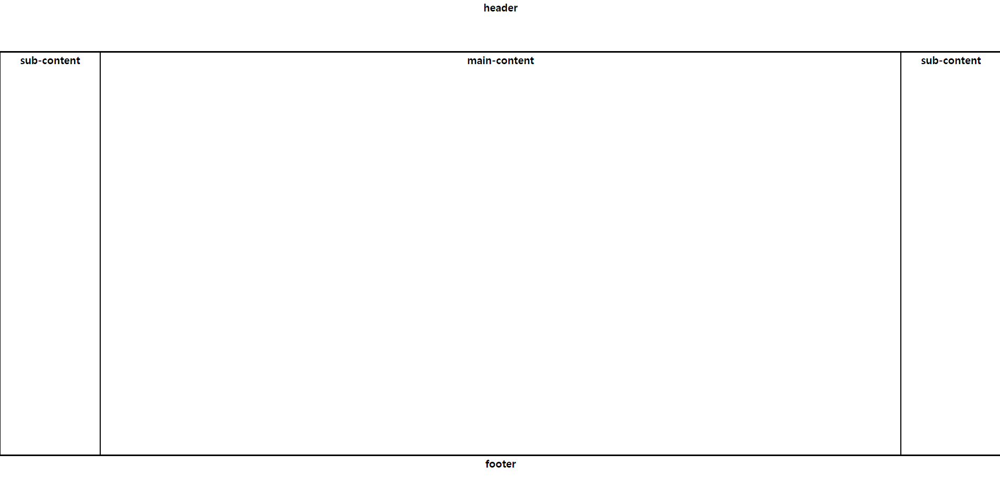

# CSS Layout 그리기



다음 그림과 같이 css를 통하여 레이아웃을 그려보도록 하겠다.


# 태그 예외처리

```css
*{
	box-sizing: border-box;
	padding: 0px;
	margin: 0px;
}
```

# Tag 작성하기

```html
    <div class="panel">
		<div class="container column">
			<div class="header font">
				header
			</div>
			<div class="content">
				<div class="container row">
					<div class="sub-content font">
						sub-content
					</div>	
					<div class="main-content font">
						main-content
					</div>
					<div class="sub-content font">
						sub-content
					</div>
				</div>
			</div>
			<div class="footer font">
				footer
			</div>
		</div>
	</div>
```

-   panel 전체적인 판을 잡아주는 역할
-   container 분할이 될때 그릇이 되어주는 역할
-   column 열로 나누어짐
-   row 행으로 나누어짐
-   font 글자 강조


# CSS 작성하기

```css
    .panel{
		width: 800px;
		height: 1500px;
	}
	.container{
		width: 100%;
		height: 100%;
		display: flex;
	}
	.row{
		flex-direction: row;
	}
	.column{
		flex-direction: column;
	}
	.header{
		flex: 100px 0 0;
		border: solid black 1px;
	}
	.content{
		flex: 80% 0 0;
		border: solid black 1px;
	}
	.footer{
		flex: calc(100% - 80% - 100px);
		border: solid black 1px;
	}
	.sub-content{
		flex: 10% 0 0;
		border: solid black 1px;
	}
	.main-content{
		flex: 80% 0 0;
		border: solid black 1px;
	}
	.font{
		font-family: sans-serif;
		font-size: 1.25em;
		font-weight: 900;
		text-align: center;
	}
```

<style>
    *{
        box-sizing: border-box;
        padding: 0px;
        margin: 0px;
    }
    .panel{
		width: 100%;
		height: 700px;
	}
	.container{
		width: 100%;
		height: 100%;
		display: flex;
	}
	.row{
		flex-direction: row;
	}
	.column{
		flex-direction: column;
	}
	.header{
		flex: 100px 0 0;
		border: solid black 1px;
	}
	.content{
		flex: 80% 0 0;
		border: solid black 1px;
	}
	.footer{
		flex: calc(100% - 80% - 100px);
		border: solid black 1px;
	}
	.sub-content{
		flex: 10% 0 0;
		border: solid black 1px;
	}
	.main-content{
		flex: 80% 0 0;
		border: solid black 1px;
	}
	.font{
		font-family: sans-serif;
		font-size: 1.25em;
		font-weight: 900;
		text-align: center;
	}

    .header:hover{
        background-color: #4242AB;
    }
    .main-content:hover{
        background-color: #4242AB;
    }
    .sub-content:hover{
        background-color: #4242AB;
    }
    .footer:hover{
        background-color: #4242AB;
    }
</style>

<div class="panel">
	<div class="container column">
		<div class="header font">
			header
		</div>
		<div class="content">
			<div class="container row">
				<div class="sub-content font">
					sub-content
				</div>	
				<div class="main-content font">
					main-content
				</div>
				<div class="sub-content font">
					sub-content
				</div>
			</div>
		</div>
		<div class="footer font">
			footer
		</div>
	</div>
</div>