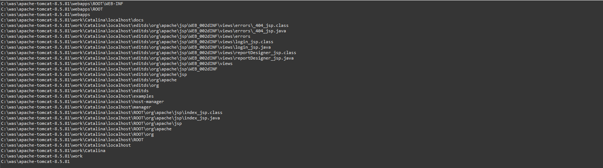
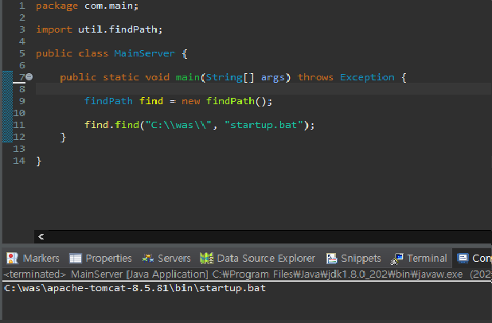

# 자바로 파일명을 입력하여 경로 찾기 

자바를 이용하여 내부 프로그램을 실행할때 실행 경로에 대한 파일 경로가 필요하다. 따라서 자바에서 파일명으로 파일 경로를 찾는 라이브러리를 만들었다. 완전탐색 선행 알고리즘 구조이다.

해당 라이브러리는 파일명으로 경로를 찾을수 있는 증명을 위해 급하게 만들었으므로. 최적회가 되지 않았다. 때문에 소스 공개는 하지 않는다.

최소 시간 복잡도 1

최대 시간 복잡도 N

또한 주의할 점으로 최대 시간 복잡도가 될 경우 모든 윈도우 파일을 찾기 때문에 속도가 느리다. 때문에 선형 알고리즘은 잘못된 선택인거 같다. 급하게 만드느라 선형 알고리즘을 사용하였는데 나중에 사용할 일이 있으면 알고리즘 방식을 바꾸어야 할거 같다. ㅎㅎ

함수
findPath() 함수는 파라미터가 두개 들어가는데
첫번쨰 인수는 기준이되는 경로이다.
C:\\ 라고 지정하면 해당 기준으로 탐색이 시작된다. 기준 경로는 변경 가능하다.

두번째 인수는 찾고자하는 파일명이다.

다음은 파일명을 찾고있다는 것을 보여주는 로그이다.

다음은 함수를 통해서 파일 경로를 구하는것을 보여주는 화면이다.

만일 소스가 필요하다면
메일로 문의 바란다. 깃허브에 안올렸다.
